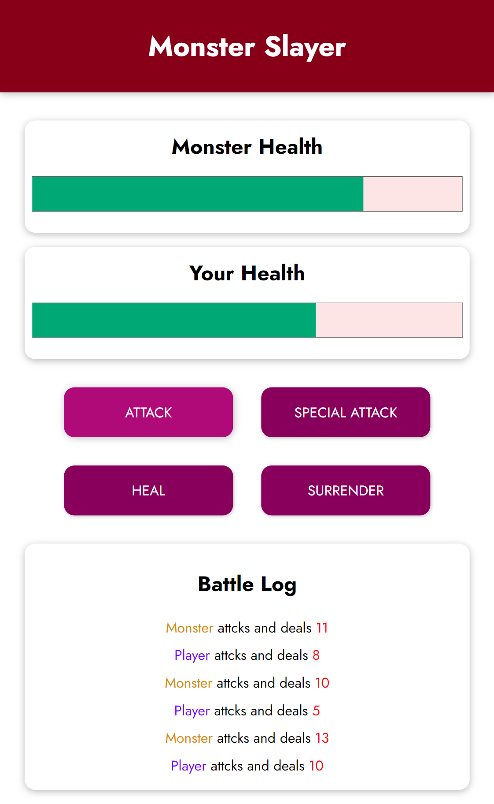

# Monster Slayer Game
### Project No.1
### Udemy Course: [Vue - The Complete Guide (incl. Router & Composition API)](https://www.udemy.com/course/vuejs-2-the-complete-guide/)

# Screenshot



## Languages and Technologies used in this project.

- HTML
- CSS 
- JavaScript
- Vue.js

## Usage

This website is built with [VueJS](https://vuejs.org/).

Added Vue.js CDN in index.html file to use Vue.js without creating Vue Application.

```bash
<script src="https://unpkg.com/vue@3/dist/vue.global.js"></script>
```

To run the project, run file: `index.html` </br>
To add your own custom styles, use the `styles.css` file.